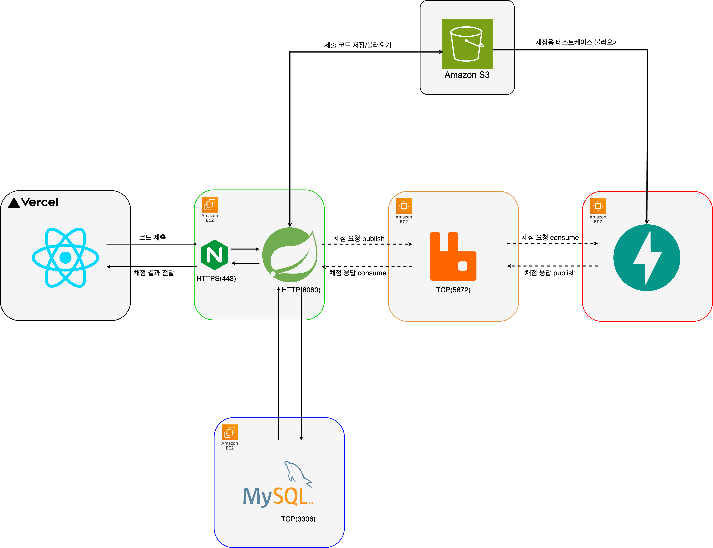

# Algoduck: 온라인 알고리즘 문제 풀이 플랫폼

## 개요
알고리즘 문제 풀이, 제출, 채점, 실시간 결과 반영까지 가능한 전체 시스템입니다.

## 시스템 아키텍처

## 구성 Repo

| 이름 | 설명 |
|------|------|
| [`server`](https://github.com/algoduck/algoduck_server) | Spring Boot 기반 API 서버 |
| [`client`](https://github.com/algoduck/algoduck_client) | React 기반 사용자 인터페이스 |
| [`judge`](https://github.com/algoduck/algoduck_judge) | FastAPI 기반 채점 서버 (MQ 기반 비동기) |
| [`test`](https://github.com/algoduck/algoduck_test) | Python 기반 테스트 스크립트 |

## 기술 스택
Spring Boot, React, FastAPI, RabbitMQ, MySQL, S3, Docker, Nginx...

...

